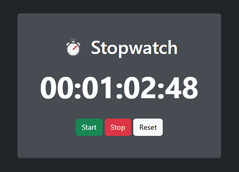

# ⏱ Stopwatch App  
A simple stopwatch web app built with **Vanilla JavaScript** and styled using **Bootstrap**.  

## Features  
- Start, pause, and reset the timer  
- Displays time in `HH:MM:SS:MS` format  
- Responsive design with Bootstrap  

## Technologies  
- HTML, CSS, JavaScript  
- Bootstrap 5 for styling  

## How to Use  
1. Open `index.html` in a browser  
2. Click **Start** to begin timing  
3. Click **Pause** to stop the timer  
4. Click **Reset** to reset the stopwatch  

## 📜 License  
MIT License  
